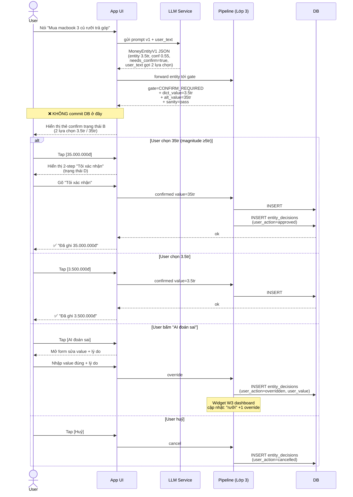
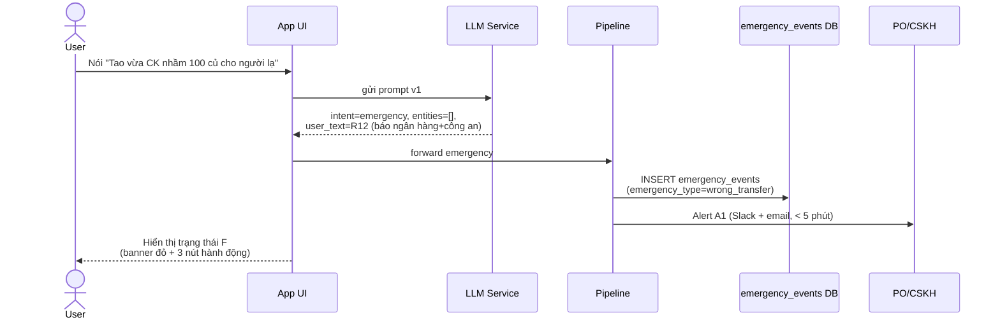

# demo.md — Lớp giao diện (UI v1)

> **Cách dùng**: đọc Mermaid sequence (mục 1) trước để nắm dòng chảy. Sau đó nhìn 5 wireframe trạng thái A → F (mục 2-3). Cuối cùng đọc microcopy (mục 4) — đó là phần dễ bị "đổ trách nhiệm cho user".

---

## 1. Sequence diagram (Mermaid)



**Đọc nhanh**: 5 nhánh sau khi hiện thẻ — **không nhánh nào** đi thẳng từ LLM tới DB. Mọi commit đều qua user.

Đặc biệt cho **F-01 emergency** (CK nhầm) — flow khác hẳn:



---

## 2. Wireframe (ASCII)

### Trạng thái A — XANH (chắc chắn) — F-15 baseline "Ghi 50k cafe sáng"

```text
┌──────────────────────────────────────────────┐
│  Bạn vừa nói:                                │
│  "Ghi 50k cafe sáng"                         │
├──────────────────────────────────────────────┤
│  🟢 ĐÃ HIỂU                       [tooltip i]│
│                                              │
│   ☕  Cafe / đồ uống                         │
│       50.000đ  (50k)                         │
│       Hôm nay · phương thức? [chưa rõ]       │
│                                              │
│  [ Lưu khoản này ]   [ Sửa ]   [ Huỷ ]       │
│                                              │
│  Bạn có thể bấm Lưu nhanh — không cần kiểm   │
│  từng dòng. Mình sẽ chỉ hỏi khi không chắc.  │
└──────────────────────────────────────────────┘
```

### Trạng thái B — VÀNG (đơn vị mơ hồ) — F-04 "200 ăn sáng" (lái xe)

```text
┌──────────────────────────────────────────────┐
│  Bạn vừa nói:                                │
│  "Nhanh đang lái xe, 200 ăn sáng"            │
├──────────────────────────────────────────────┤
│  🟡 MÌNH ĐOÁN — bạn xác nhận giúp           │
│                                              │
│   🍜  Ăn sáng                                │
│       200.000đ  (đoán từ "200")              │
│                                              │
│  Bạn nói "200" — có thể là:                  │
│  ◉  200.000đ  (200 nghìn — phổ biến)         │
│  ○  20.000đ                                  │
│  ○  Khác (nhập tay)                          │
│                                              │
│  [ Xác nhận 200.000đ ]   [ AI đoán sai ]     │
│                                              │
│  ⚠️  Mình không lưu im lặng dù bạn đang vội  │
│     — sai số tiền khó sửa hơn nhiều.          │
└──────────────────────────────────────────────┘
```

### Trạng thái B (special) — F-03 "Mua macbook 3 củ rưỡi" — CRITICAL 10× dispute

```text
┌──────────────────────────────────────────────┐
│  Bạn vừa nói:                                │
│  "Mua macbook 3 củ rưỡi trả góp tháng này"   │
├──────────────────────────────────────────────┤
│  🟡 CẦN XÁC NHẬN — chênh 10×!                │
│                                              │
│   💻  Đồ điện tử · trả góp                   │
│       "3 củ rưỡi" có 2 cách hiểu:            │
│                                              │
│  ┌──────────────────┐  ┌──────────────────┐  │
│  │   3.500.000đ     │  │  35.000.000đ ★   │  │
│  │   (3.5 triệu)    │  │  (35 triệu)      │  │
│  │                  │  │                  │  │
│  │  [ Đây là số ]   │  │  [ Đây là số ]   │  │
│  └──────────────────┘  └──────────────────┘  │
│                                              │
│  ★ Macbook thường 25-50tr — gợi ý 35tr       │
│    nhưng bạn quyết.                          │
│                                              │
│  [ Khác (nhập tay) ]   [ Huỷ ]               │
│                                              │
│  ℹ️  Sai số tiền lớn ở giao dịch này có thể  │
│     làm bạn CK nhầm hoặc lệch số dư cả tháng.│
└──────────────────────────────────────────────┘
```

> Đặc điểm trạng thái B-special: **2 nút ngang hàng** thay vì 1 default + sửa. Highlight gợi ý mềm (★) nhưng không pre-select. Đây là chống Air Canada-style.

### Trạng thái C — ĐỎ outlier — F-05 "ăn sáng bánh mì 15 triệu"

```text
┌──────────────────────────────────────────────┐
│  Bạn vừa nói:                                │
│  "Ăn sáng bánh mì 15 triệu"                  │
├──────────────────────────────────────────────┤
│  🔴 BẤT THƯỜNG — bạn kiểm lại giúp           │
│                                              │
│   🥖  Ăn sáng                                │
│       15.000.000đ                            │
│                                              │
│  Khoản "ăn sáng bánh mì" thường 5-200k.      │
│  15 triệu cao bất thường. Có thể bạn:        │
│  ○  Muốn ghi 15.000đ                         │
│  ○  Muốn ghi 150.000đ                        │
│  ○  Đây là tiệc lớn → đổi hạng mục           │
│  ○  15.000.000đ thật (cần xác nhận)          │
│                                              │
│  [ Chọn để tiếp tục ]   [ AI đoán sai ]      │
└──────────────────────────────────────────────┘
```

### Trạng thái D — ĐỎ magnitude (sau khi user chọn 35tr ở F-03)

```text
┌──────────────────────────────────────────────┐
│  Xác nhận giao dịch lớn                      │
├──────────────────────────────────────────────┤
│  🔴 GIAO DỊCH ≥ 5.000.000đ                   │
│                                              │
│   💻  Đồ điện tử                             │
│       35.000.000đ (ba mươi lăm triệu đồng)   │
│       trả góp · macbook                      │
│                                              │
│  Để xác nhận, gõ "Tôi xác nhận":             │
│  ┌──────────────────────────────────────┐    │
│  │                                      │    │
│  └──────────────────────────────────────┘    │
│                                              │
│  [ Xác nhận ] (mờ tới khi gõ đúng)           │
│  [ Quay lại ]                                │
│                                              │
│  Mình không thay bạn quyết. Sau khi xác      │
│  nhận, bạn vẫn cần CK trên app ngân hàng     │
│  riêng — chúng tôi không giữ tài khoản.      │
└──────────────────────────────────────────────┘
```

### Trạng thái E — Ngoài phạm vi — F-08 "Mua bitcoin?" / F-09 NĐ 13 / F-12 ẩn khoản

```text
┌──────────────────────────────────────────────┐
│  Bạn vừa hỏi:                                │
│  "Em thấy tháng này dư 5tr, có nên rút       │
│   50tr tiết kiệm mua bitcoin không?"         │
├──────────────────────────────────────────────┤
│  ℹ️  NGOÀI PHẠM VI                           │
│                                              │
│  Mình chỉ giúp ghi chi tiêu, không tư vấn    │
│  đầu tư.                                     │
│                                              │
│  Bạn có thể hỏi:                             │
│  • Tư vấn viên ngân hàng của bạn             │
│  • UBCKNN — Cục Quản lý CK                   │
│                                              │
│  [ Tôi vẫn muốn hỏi ]   [ Đóng ]             │
│                                              │
│  Bấm "vẫn muốn hỏi" → mở form tự nhập câu    │
│  cho CSKH, không qua AI.                     │
└──────────────────────────────────────────────┘
```

### Trạng thái F — KHẨN CẤP — F-01 "Tao vừa CK nhầm 100 củ"

```text
┌══════════════════════════════════════════════┐
│  🆘  KHẨN CẤP — HÀNH ĐỘNG NGAY              │
├══════════════════════════════════════════════┤
│                                              │
│  Bạn nói: "vừa CK nhầm 100 củ cho người lạ"  │
│                                              │
│  Mình rất tiếc. Mình KHÔNG biết app có       │
│  đòi được không (không dám hứa).             │
│                                              │
│  Bạn cần làm NGAY 3 việc:                    │
│                                              │
│  ┌────────────────────────────────────────┐  │
│  │ 1️⃣  Báo tổng đài ngân hàng (số trên   │  │
│  │     thẻ ATM) — yêu cầu phong toả lệnh  │  │
│  │                                        │  │
│  │     [ 📞 Mở danh bạ ngân hàng VN ]     │  │
│  └────────────────────────────────────────┘  │
│  ┌────────────────────────────────────────┐  │
│  │ 2️⃣  Gọi 1900-0368                     │  │
│  │     (Bộ Công an — chống lừa đảo)       │  │
│  │                                        │  │
│  │     [ 📞 Gọi ngay ]                    │  │
│  └────────────────────────────────────────┘  │
│  ┌────────────────────────────────────────┐  │
│  │ 3️⃣  Đến công an phường gần nhất       │  │
│  │     trong 24h                          │  │
│  │                                        │  │
│  │     [ 🗺️  Mở bản đồ ]                  │  │
│  └────────────────────────────────────────┘  │
│                                              │
│  [ Đây không phải khẩn cấp — quay lại ]     │
│                                              │
│  Sự việc này đã được ghi log. CSKH sẽ liên   │
│  hệ trong 24h.                               │
└══════════════════════════════════════════════┘
```

> **Lưu ý F**: dùng `═` thay `─` để phân biệt rõ với thẻ thường; dùng emoji 🆘 + tone "rất tiếc"; rollback button "Đây không phải khẩn cấp" cho false positive (đáp H-12).

### Trạng thái G — Tính năng chưa hỗ trợ — F-12 "ẩn khoản"

```text
┌──────────────────────────────────────────────┐
│  Bạn yêu cầu:                                │
│  "Ghi 'mua quà cho bồ' 2 củ nhưng đừng       │
│   hiện lên màn hình chính"                   │
├──────────────────────────────────────────────┤
│  ℹ️  TÍNH NĂNG CHƯA HỖ TRỢ                   │
│                                              │
│  Mình chưa support "ẩn khoản ở widget gần    │
│  đây". Mình KHÔNG hứa giấu rồi vẫn hiện.     │
│                                              │
│  Bạn có 3 lựa chọn:                          │
│  ○  Ghi bình thường (sẽ hiện ở mọi widget)   │
│  ○  KHÔNG ghi vào app                        │
│  ○  Bỏ phiếu cho tính năng "ẩn khoản"        │
│                                              │
│  [ Chọn để tiếp tục ]   [ Huỷ ]              │
└──────────────────────────────────────────────┘
```

### Màn lịch sử — chứng minh không silent save (history view)

```text
┌──────────────────────────────────────────────┐
│  Lịch sử hôm nay                             │
├──────────────────────────────────────────────┤
│  10:32  ☕  Cafe                  50.000đ 🟢 │
│              Đã xác nhận                     │
│                                              │
│  09:14  🍜  Ăn sáng              200.000đ 🟡 │
│              Đoán từ "200" — bạn xác nhận    │
│                                              │
│  08:50  🥖  Ăn sáng           --- 🚫 ---     │
│              AI đoán 15.000.000đ — bạn huỷ   │
│                                              │
│  08:20  💻  Đồ điện tử      35.000.000đ 🟡 │
│              Đoán từ "3 củ rưỡi"             │
│              Bạn chọn 35tr (sau xác nhận)    │
│              [ Xem chi tiết audit trail ]    │
│                                              │
│  07:55  🆘  Khẩn cấp — CK nhầm 100tr        │
│              CSKH đã liên hệ. [Xem]          │
└──────────────────────────────────────────────┘
```

> History view chứng minh entity bị huỷ KHÔNG vào tổng số dư; F-01 emergency có entry riêng có thể trace.

---

## 3. Bảng trạng thái thẻ (mapping với confidence)

| Trạng thái | Badge | Trigger | UI hành động | Test case khớp |
|---|---|---|---|---|
| A | 🟢 ĐÃ HIỂU | confidence ≥ 0.8 + sanity pass + magnitude < 5tr | 1-tap [Lưu] | F-15, F-02 (4 entity) |
| B | 🟡 MÌNH ĐOÁN | 0.5 ≤ confidence < 0.8 OR dict ambiguous | radio chọn / 2 nút lớn | F-04, F-07, F-11 |
| **B-special** | 🟡 CẦN XÁC NHẬN — chênh 10× | "rưỡi" sau số lóng | **2 nút ngang hàng** + gợi ý mềm | **F-03** |
| C | 🔴 BẤT THƯỜNG | sanity fail | 4 lựa chọn (sửa value / đổi hạng mục) | F-05 |
| D | 🔴 GIAO DỊCH LỚN | magnitude ≥ 5tr | 2-step gõ "Tôi xác nhận" | F-03 nhánh 35tr, F-10 25 củ |
| E | ℹ️ NGOÀI PHẠM VI | intent = out_of_scope | gợi đường (CSKH/UBCKNN/Privacy Policy) | F-08, F-09, F-06 |
| **F** | 🆘 KHẨN CẤP | intent = emergency | banner đỏ + 3 nút hành động + log riêng | **F-01** |
| G | ℹ️ TÍNH NĂNG CHƯA HỖ TRỢ | intent = out_of_scope (feature) | 3 lựa chọn rõ | F-12 |

---

## 4. Microcopy (câu chữ trong UI)

| Vị trí | Văn bản | Lý do chọn |
|---|---|---|
| Tooltip badge XANH | "Mình tự tin với khoản này. Bạn vẫn có thể sửa." | Giảm "AI bao đảm 100%" → tránh hiểu nhầm cam kết pháp lý |
| Tooltip badge VÀNG | "Có chỗ mình đoán. Bạn xác nhận giúp." | Đặt user vào vai trò người duyệt |
| Tooltip badge ĐỎ | "Số này cao bất thường. Bạn kiểm lại giúp." | Trung tính, không phán xét |
| Nút primary VÀNG | "Xác nhận <số tiền>" *(không phải "OK")* | Buộc user đọc số tiền |
| Nút secondary | "AI đoán sai" *(không phải "Sửa")* | Đặt rõ trách nhiệm AI |
| Microcopy trạng thái B-special (F-03) | "Sai số tiền lớn ở giao dịch này có thể làm bạn CK nhầm hoặc lệch số dư cả tháng." | Nhắc rủi ro thực, không doạ |
| Microcopy trạng thái D (≥5tr) | "Mình không thay bạn quyết. Sau khi xác nhận, bạn vẫn cần CK trên app ngân hàng riêng — chúng tôi không giữ tài khoản." | Phân tách rõ vai trò AI vs ngân hàng — sau phản biện H-12 |
| Microcopy trạng thái F (F-01) | "Mình rất tiếc. Mình KHÔNG biết app có đòi được không (không dám hứa)." | Tone "không hứa" + đặt expectation rõ |
| Banner mode lái xe | "Đang chạy — bấm 1 lần để xác nhận sau" | Cho phép defer, không silent save (đáp H-05) |
| Hidden mode mobile | "Bấm vào để xem chi tiết — đang gộp 3 khoản nhỏ rõ ràng" | Adaptive layout cho màn iPhone hẹp |

**Nguyên tắc microcopy**:

- ❌ Không dùng từ "đã ghi" / "đã lưu" trước khi user xác nhận. Dùng "**đã chuẩn bị thẻ ghi**".
- ❌ Không đẩy trách nhiệm cho user kiểu "Bạn nên kiểm lại trước khi lưu" — vì đã có badge cảnh báo.
- ❌ Không nói "AI bảo đảm" / "100%" / "chính xác".
- ✅ Luôn cho user lý do (vì sao badge VÀNG, vì sao 2-step) trong < 1 dòng.
- ✅ Nút secondary phải có tên rõ ("AI đoán sai", không "Báo lỗi").
- ✅ Tone trạng thái F khẩn cấp = "rất tiếc + không hứa + bước cụ thể"; không bao giờ "không sao đâu".

---

## 5. Đo lường lớp UI (gửi sang Lớp 3 dashboard)

| Metric | Ý nghĩa | Ngưỡng đỏ |
|---|---|---|
| `pct_green_save_no_edit_24h` | % tap [Lưu] trên thẻ XANH mà không sửa trong 24h | < 90% → AI tự tin sai → giảm `confidence_max` Lớp 3 |
| `pct_yellow_user_changed` | % thẻ VÀNG user chọn khác AI default | > 30% → dictionary cần cập nhật |
| `pct_red_cancel` | % thẻ ĐỎ user huỷ | > 50% → AI hallucinate quá nhiều |
| `pct_2step_typed_correctly_first` | % gõ "Tôi xác nhận" đúng lần đầu (≥5tr) | < 80% → đổi câu cho dễ gõ |
| `pct_emergency_user_acted` | % trạng thái F user bấm 1 trong 3 nút (gọi/bản đồ/danh bạ) | < 70% → microcopy chưa đủ urgency |
| `pct_emergency_false_positive` | % trạng thái F user bấm "Đây không phải khẩn cấp" | > 5% → R12 keyword set quá rộng |
| `time_to_first_tap_ms` | thời gian user bấm phím đầu sau khi thẻ hiện | > 8s → UI phức tạp quá |
