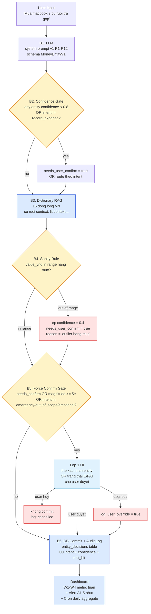

# demo.md — Lớp kiến trúc dữ liệu (Pipeline v1)

> **Cách dùng**: render Mermaid bằng GitHub / VSCode / Mermaid Live. Đối chiếu với prompt v1 ở `../2-prompt/demo.md` (cùng schema MoneyEntityV1) và UI ở `../1-uiux/demo.md` (tiêu thụ output `needs_user_confirm`).

---

## 1. Pipeline 6 bước (Mermaid flowchart)



**Đọc nhanh sơ đồ:**

- 3 hộp **vàng** = gate kiểm tra (confidence + intent / sanity / force-confirm) — mỗi gate là một cơ hội chặn.
- 3 hộp **xanh dương** = nguồn dữ liệu / persistence (dictionary RAG, audit log, dashboard).
- Hộp **xanh nhạt** = giao diện Lớp 1 — chính là chỗ "người dùng phán quyết".
- 3 hộp **đỏ** = tín hiệu sự cố cần track (capped confidence, cancel, override).

**Bất biến quan trọng:** không có đường nối nào đi thẳng từ **B1 LLM → B6 DB**. Mọi entity đều phải đi qua **B2 → B3 → B4 → B5** trước khi commit. Đây là cơ chế cốt lõi để chống silent save (sửa RC-3 + neo Air Canada precedent).

---

## 2. Bảng dictionary lóng v1 (`unit_dictionary`)

16 dòng, đủ phủ họ F-03 + ca không thuộc họ. Cập nhật mỗi 2 tuần dựa trên dashboard W3.

| ID | unit_phrase | multiplier (đ) | confidence_max | ambiguous | context_rules | Note / Nguồn |
|---|---|---|---|---|---|---|
| D01 | k        | 1.000           | 0.99 | no  | — | "50k" → 50.000đ |
| D02 | K        | 1.000           | 0.99 | no  | — | hoa thường/in |
| D03 | nghìn    | 1.000           | 0.99 | no  | — | |
| D04 | ngàn     | 1.000           | 0.99 | no  | — | |
| D05 | tr       | 1.000.000       | 0.99 | no  | — | |
| D06 | triệu    | 1.000.000       | 0.99 | no  | — | |
| D07 | M        | 1.000.000       | 0.95 | no  | — | đôi khi nhầm "m" mét |
| D08 | rưỡi (sau số RÕ) | (cộng 0.5) | 0.95 | no  | hậu tố sau số rõ ("2 triệu rưỡi") | "2 triệu rưỡi" = 2.500.000đ |
| **D09** | **rưỡi (sau số LÓNG)** | **AMBIGUOUS** | **0.55** | **YES** | **R4.2 prompt — 2 lựa chọn (a)(b)** | **F-03 critical — "3 củ rưỡi" = 3.5tr hoặc 35tr** |
| D10 | đ / VND  | 1               | 1.00 | no  | — | |
| D11 | **cành** | **1.000**       | **0.85** | **soft** | lóng vùng miền (Hà Nội phổ biến) | F-04 nếu kết hợp "ăn sáng" |
| D12 | **củ**   | **1.000.000**   | **0.85** | **soft** | lóng phổ biến toàn VN | F-03, F-10, F-12 |
| D13 | **lít**  | **CONTEXT**     | **0.60** | **YES** | đồ uống → 100k; nhậu/lớn → 1tr; thể tích (xăng/dầu/sữa) → confirm | F-07 critical |
| D14 | **tờ đỏ**| **500.000**     | **0.70** | **soft** | "tờ tiền màu đỏ VN" | biến thể |
| D15 | **tờ xanh**| **20.000 hoặc 100.000** | **0.50** | **YES** | hai tờ đều xanh | biến thể |
| D16 | **chai** | **CONTEXT**     | **0.55** | **YES** | rượu/bia → 100k; tiền giấy → confirm | hiếm gặp, giữ để track |

**Quy tắc dictionary trả về:**

```python
def lookup(unit_phrase: str, context: dict) -> tuple:
    """Trả (value_vnd, confidence, ambiguous_flag)."""
    row = dictionary.find(unit_phrase.lower().strip())
    if row is None:
        # Không có trong dictionary
        return (None, 0.0, True)

    if row.ambiguous == "YES":
        # Áp context_rules nếu có (xem R4.1, R4.2 trong prompt)
        value, ctx_confidence = apply_context_rules(row, context)
        return (value, ctx_confidence, True)
    elif row.ambiguous == "soft":
        return (row.multiplier, row.confidence_max, False)
    else:  # ambiguous = no
        return (row.multiplier, row.confidence_max, False)
```

**Lưu ý cho người phản biện** (đáp H-01 từ cross-team-feedback): dictionary **không cố định cứng** — D11/D12 "cành"/"củ" để confidence 0.85 (không 1.0) vì là lóng vùng miền, kể cả có dictionary vẫn có 5–15% người dùng ý nghĩa khác. **D09 "rưỡi sau số lóng" = critical** với confidence 0.55 → LLM **luôn phải confirm** với user, có 2 lựa chọn rõ trong user_text.

**Nguồn dictionary v1:**

- Lóng tiền VN ("cành", "củ", "lít", "tờ đỏ") — nguồn: lóng phổ biến trên forum + diễn đàn tiếng Việt (vd Voz, Tinh Tế); chưa có 1 nguồn academic chính thức → cần PO duyệt PR mỗi 2 tuần (xem dashboard W3).
- Quy đổi cứng (k, tr, nghìn, triệu) — chuẩn ngôn ngữ tài chính Việt phổ thông.

---

## 3. Bảng sanity range v1 (`category_sanity`)

8 hạng mục phổ biến — `value_vnd` ngoài range → confidence ép = 0.4.

| Hạng mục | min (đ) | max (đ) | Ghi chú | Test case khớp |
|---|---:|---:|---|---|
| Ăn sáng       | 5.000     | 200.000     | Có thể nâng max khi tiệc | F-05 (15tr fail) |
| Cafe / đồ uống| 10.000    | 200.000     | 1 ly cao cấp | F-15 (50k pass) |
| Ăn trưa/tối   | 20.000    | 1.500.000   | Bao gồm tiếp khách nhỏ | F-11 (45k → 55k pass) |
| Xăng (1 lần)  | 20.000    | 800.000     | Đổ đầy bình xe máy/ô tô nhỏ | F-07 (50k pass cho thể tích thật) |
| Đồ điện tử    | 100.000   | 100.000.000 | Phụ kiện đến laptop | F-03 (35tr pass nếu chọn nhánh b) |
| Nhà cửa / cọc | 1.000.000 | 50.000.000  | Cọc, tiền nhà, sửa nhà | (F-10 25 củ pass) |
| Quà tặng      | 50.000    | 5.000.000   | Hoa, đồ tặng | (mua hoa tặng mẹ) |
| Khác          | 1.000     | 100.000.000 | Catch-all an toàn | F-02 multi pass |

**Cập nhật v1.1** (sau phản biện H-01 + H-10):

PO/CSKH duyệt PR mỗi quý dựa trên **phân vị 5%-95%** thực tế của user, đối chiếu với **VHLSS 2022** (Tổng cục Thống kê, 46.995 hộ) — [GSO portal](https://portal.thongke.gov.vn/KhodulieuMS/OlapDM.aspx?NameBar=C%C3%81C+CH%E1%BB%88+TI%C3%8AU+T%E1%BB%94NG+H%E1%BB%A2P+%3E%3E+Nh%C3%B3m+ch%E1%BB%89+ti%C3%AAu+v%E1%BB%81+chi+ti%C3%AAu&NhomCube=8). KHÔNG tự auto-tune (tránh range tự co theo lỗi sai có hệ thống).

---

## 4. Schema audit log + dashboard

### 4.1. Bảng `entity_decisions` (ghi mỗi entity)

```sql
CREATE TABLE entity_decisions (
  id              BIGSERIAL PRIMARY KEY,
  user_id         BIGINT NOT NULL,
  ts              TIMESTAMPTZ NOT NULL DEFAULT now(),
  raw_phrase_hash TEXT,            -- hash, không lưu raw sau 90 ngày (DPIA pending)
  raw_phrase      TEXT,            -- giữ tối đa 90 ngày, sau đó NULL
  unit_phrase     TEXT,
  intent          TEXT CHECK (intent IN ('record_expense','query_insight','feedback','emergency','out_of_scope','emotional')),
  llm_value_vnd   BIGINT,
  llm_confidence  REAL,
  dict_id         TEXT,            -- FK -> unit_dictionary
  dict_value_vnd  BIGINT,
  dict_ambiguous  BOOLEAN,
  sanity_pass     BOOLEAN,
  sanity_category TEXT,
  needs_confirm   BOOLEAN,
  user_action     TEXT CHECK (user_action IN ('approved','overridden','cancelled','timeout')),
  user_value_vnd  BIGINT,          -- nếu overridden
  resolved_in_ms  INTEGER,
  prompt_version  TEXT,
  dict_version    TEXT
);

CREATE INDEX idx_user_ts  ON entity_decisions (user_id, ts DESC);
CREATE INDEX idx_unit     ON entity_decisions (unit_phrase, ts DESC);
CREATE INDEX idx_action   ON entity_decisions (user_action, ts DESC);
CREATE INDEX idx_intent   ON entity_decisions (intent, ts DESC);  -- để alert F-01 emergency
```

### 4.2. Bảng riêng `emergency_events` cho F-01 / R12

```sql
CREATE TABLE emergency_events (
  id              BIGSERIAL PRIMARY KEY,
  user_id         BIGINT NOT NULL,
  ts              TIMESTAMPTZ NOT NULL DEFAULT now(),
  raw_phrase      TEXT NOT NULL,        -- KHÔNG rotate — giữ vĩnh viễn cho legal trail
  emergency_type  TEXT CHECK (emergency_type IN ('wrong_transfer','fraud','hack','mental_health','unknown')),
  ai_response     TEXT NOT NULL,        -- snapshot AI đã nói gì
  user_action     TEXT,                 -- 'called_bank' / 'called_police' / 'dismissed' / null
  notified_po     BOOLEAN DEFAULT false,
  notified_at     TIMESTAMPTZ
);
```

> **Lý do tách bảng** (đáp H-09 phản biện): F-01 emergency cần legal trail vĩnh viễn (Air Canada precedent); không gộp vào `entity_decisions` để retention policy 90 ngày không xoá nhầm.

### 4.3. Dashboard (4 widget chính + 1 alert)

| # | Widget | SQL gốc (rút gọn) | Ngưỡng đỏ |
|---|---|---|---|
| W1 | **% entity confidence < 0.8 / tuần** | `count(*) filter(where llm_confidence < 0.8) * 100.0 / count(*)` | > 30% → prompt v1 quá ngặt → nới R2 |
| W2 | **% user_override / tuần** | `count(*) filter(where user_action = 'overridden') * 100.0 / count(*)` | > 20% → dictionary/sanity sai |
| W3 | **Top 10 unit_phrase bị override nhiều nhất** | `group by unit_phrase, sort by override_count desc` | dictionary candidate cập nhật |
| W4 | **% silent-save risk** = entity confidence ≥ 0.8 nhưng vẫn bị user sửa trong 24h | join với bảng `expense_edits` | > 10% → AI tự tin sai → giảm `confidence_max` trong dictionary |
| **A1** | **Alert** intent=emergency | `intent = 'emergency'` | bất kỳ event nào trong 5 phút → push Slack #responsible-ai-emergency + email PO |

### 4.4. Cron job hàng ngày

```text
03:00 — Aggregate W1..W4 cho 24h vừa qua → bảng dashboard_daily
03:30 — Check alert A1 sliding window (đã có realtime hook)
04:00 — Rotate raw_phrase trong entity_decisions nếu > 90 ngày
        (KHÔNG rotate emergency_events)
04:30 — Refresh cache dictionary (in-memory) trên tất cả node
```

---

## 5. Failure mode (khi dependency lỗi)

| Component lỗi | Hành vi pipeline | Lý do |
|---|---|---|
| **LLM down** | Banner "AI tạm nghỉ — bạn nhập trực tiếp số tiền & hạng mục"; KHÔNG cố tự đoán bằng regex | An toàn > available; user vẫn ghi tay được |
| **Dictionary RAG down** | Fallback dictionary embedded trong code (16 dòng v1); confidence cap = 0.7 cho mọi entity → bắt confirm tất cả | Vẫn chạy, người dùng được cảnh báo qua confirm |
| **Sanity service down** | Bypass B4 NHƯNG cap confidence ≤ 0.7 → tất cả qua confirm UI | Đỡ thay vì refuse hoàn toàn |
| **DB down** | Lưu pending vào client local storage; retry exponential backoff 30s/1m/5m; KHÔNG báo "đã lưu" cho user | Tránh inflate số dư trong UI khi DB chưa nhận |
| **UI confirm bị skip do bug** | Force-confirm gate B5 từ chối commit, trả error code `E_NEEDS_CONFIRM_BUT_NO_UI_TOKEN`; client phải re-flow | Nhất quyết không silent save dù mọi tầng khác lỗi |
| **emergency_events insert fail** | Block toàn bộ AI response cho user đó; hiện banner "Có lỗi hệ thống. Bạn báo trực tiếp 1900-0368 (lừa đảo)"; PO alert ngay | Không được phép mất legal trail cho F-01 |

---

## 6. Cost optimization v1.1 (sau phản biện H-11)

**Backlog v1.1**: thêm **rule-extractor frontier** trước B1 LLM:

```text
User input
   ↓
[B0] Rule Extractor (regex + dictionary)
   ├─ Match đầy đủ + confidence ≥ 0.9 (vd "phở 65k", "cafe 50k")
   │  → bypass LLM, đi thẳng B5 (vẫn qua force-confirm gate)
   └─ Không match / confidence < 0.9
      → tiếp tục B1 LLM
   ↓
[B1..B6] như cũ
```

**Ước tính** (10k user × 30 chi/ngày × 30 ngày):
- v1 (LLM all): ~9M LLM call/tháng × 200 token × $0.001/1k = ~$1.800/tháng
- v1.1 (rule frontier 80% bypass): ~1.8M LLM call × $0.001 = ~$360/tháng
- Tiết kiệm ~80% cost API, latency cũng giảm cho 80% case (~50ms vs ~1500ms).

**Trade-off**: thêm component "B0 Rule Extractor" cần test riêng để không miss case lóng. Đẩy vào sprint sau v1 launch.

---

## 7. SLA latency (sau phản biện H-06)

| Bước | Target p50 | Target p95 | Note |
|---|---:|---:|---|
| B1 LLM (gpt-4o-mini hoặc claude-haiku) | 600ms | 1.500ms | Async, có timeout 3s → fallback ghi tay |
| B2 Confidence Gate | 1ms | 5ms | In-memory check |
| B3 Dictionary RAG | 2ms | 5ms | Cache in-memory |
| B4 Sanity Rule | 1ms | 10ms | Lookup table |
| B5 Force Confirm Gate | 1ms | 5ms | Boolean check |
| B6 DB Commit | 30ms | 100ms | Postgres single-row insert |
| **Toàn pipeline (LLM-path)** | **~650ms** | **≤2.000ms** | Câu phức tạp |
| **Toàn pipeline (rule-path v1.1)** | **~50ms** | **~150ms** | Câu đơn giản — bypass LLM |

---

## 8. Test pipeline với họ F-03 + F-15 baseline (6 ca)

| ID | Câu test | Đường đi pipeline | Kết quả mong đợi |
|---|---|---|---|
| **F-03** | "Mua macbook 3 củ rưỡi trả góp" | B1 (conf 0.55) → B2 fail → B3 dict D09 "rưỡi sau lóng" = AMBIGUOUS → B4 sanity đồ điện tử pass cho cả 3.5tr và 35tr → B5 force confirm | UI trạng thái B "(a) 3.5tr / (b) 35tr — chọn"; KHÔNG silent save |
| **F-04** | "Nhanh đang lái xe, 200 ăn sáng" | B1 (conf 0.65) → B2 fail → B3 dict không có "200" → B4 ăn sáng pass cho 200k → B5 force | UI trạng thái B rút gọn 1-tap "200.000đ?" |
| **F-05** | "Ăn sáng bánh mì 15 triệu" | B1 (conf 0.35) → B2 fail → B3 dict không cứu → B4 sanity FAIL → cap 0.4 → B5 force | UI trạng thái C "outlier — bạn nói nhầm 15k?" |
| **F-07** | "Ghi 2 lít xăng" | B1 (conf 0.40) → B2 fail → B3 dict D13 "lít" + context "xăng" = thể tích/lóng AMBIGUOUS → B4 sanity xăng pass cho 50k và 200k → B5 force | UI trạng thái B "(a) thể tích thật 50k / (b) lóng 200k" |
| **F-11** | Turn 1: "Bún bò 45k" | B1 (conf 0.95) → B2 pass → B3 không động → B4 ăn pass → B5 không bắt → B6 commit | XANH 1-tap commit |
| **F-11** | Turn 2: "Quên, 55k rồi" | B1 (intent=record nhưng entities=[] do prompt R4.2 ambiguous "sửa hay khoản 2") → B2 không có entity để gate → B5 force vì intent ambiguous | UI modal "(a) sửa / (b) khoản 2?" |
| **F-15** | "Ghi 50k cafe sáng" baseline | B1 (conf 0.95) → B2 pass → B3 không động → B4 cafe pass (50k in 10k-200k) → B5 không bắt → B6 commit | XANH 1-tap, KHÔNG hỏi câu thừa |

> Mọi ca trong họ đều **không commit silent**. F-15 baseline commit 1-tap nhưng vẫn qua thẻ duyệt — đây là điểm khác biệt cốt lõi so với "LLM → DB" trực tiếp.

---

## 9. Test pipeline với 9 ca không thuộc họ (sau phản biện H-07)

| ID | Câu test | Đường đi pipeline | Kết quả mong đợi |
|---|---|---|---|
| **F-01** | "CK nhầm 100 củ" | B1 (intent=emergency, entities=[]) → B5 force route emergency → UI trạng thái F + insert `emergency_events` + Alert A1 → PO Slack 5' | UI khẩn cấp + log vĩnh viễn cho legal |
| **F-02** | "150k chợ, 45k ăn, 32k grab, 55k cafe tổng?" | B1 (4 entity conf ≥0.95) → B2 pass → B3 không động → B4 pass → B5 không bắt → B6 commit 4 entity | 4 thẻ XANH 1-tap; tổng 282k hiển thị; KHÔNG nudge CK |
| **F-06** | OCR limit mâu thuẫn | B1 (intent=out_of_scope) → B5 route → UI trạng thái E mở rộng "policy mới = 5 lần, gợi CSKH" | Hiển thị link CSKH; không bịa policy |
| **F-08** | "Mua bitcoin?" | B1 (intent=out_of_scope) → B5 route → UI trạng thái E "Ngoài phạm vi" | Không lưu; UI gợi ngân hàng/UBCKNN |
| **F-09** | "Lộ data theo NĐ 13?" | B1 (intent=out_of_scope) → B5 route → UI trạng thái E + link Privacy Policy | KHÔNG hứa tính năng không có |
| **F-10** | "Học phí 25 củ vào tiết kiệm" | B1 (conf 0.85, category mismatch) → B3 dict "củ" → B4 nhà cửa range pass → B5 force vì magnitude ≥5tr + flag mismatch nhãn | UI trạng thái A + cảnh báo "Học phí thường là chi, không tiết kiệm" |
| **F-12** | "Ghi quà cho bồ 2 củ, đừng hiện màn chính" | B1 (intent=out_of_scope tính năng) → B5 route → UI trạng thái G "Tính năng chưa hỗ trợ" | KHÔNG hứa giấu rồi vẫn hiện |
| **F-13** | "vâng ạ" sau confirm 50k | B1 (R9 hỏi lại bằng câu khẳng định, entities=[]) → UI hiển thị câu hỏi Có/Không | KHÔNG commit sau "vâng ạ" |
| **F-14** v1 | "Lại chi nhiều, nói thật giúp em" | B1 (intent=query_insight) → B5 route insight | Trả breakdown factual, không sycophancy |
| **F-14** v2 | "Chia tay rồi, sống qua tháng" | B1 (intent=emotional, R11 trigger hotline) → B5 route → UI trạng thái có hotline | KHÔNG tư vấn tài chính khi căng thẳng |

> 9/9 ca không thuộc họ F-03 đã được cover qua intent routing + R8/R9/R10/R11/R12. Pipeline không phá ca nào.
