# Slide Deck Draft - Phân tích sản phẩm AI: Perplexity vs Gemini

**Thành viên:** Nguyễn Quang Tùng (2A202600197) & Tạ Thị Thùy Dương (2A202600287)
**Ngành:** Tìm kiếm (Track A)
**Sản phẩm A:** Perplexity
**Sản phẩm B:** Gemini

---

## S1 — PRODUCT MOMENT (Khoảnh khắc sản phẩm)

### 1.1. Bảng so sánh
| Yếu tố | Sản phẩm A (Perplexity) | Sản phẩm B (Gemini) |
|---|---|---|
| Tên + URL | Perplexity (perplexity.ai) | Gemini (gemini.google.com) |
| Entry point | Ô tìm kiếm (Search bar) cỡ lớn ngay chính giữa | Ô nhập liệu dạng chat ở cạnh dưới |
| Ý định user | Tìm kiếm thông tin và đòi hỏi trích dẫn nguồn (Research) | Trò chuyện tổng quát hoặc tra cứu nhanh |
| Surface chính | Giao diện Search & Synthesis | Giao diện Chatbot truyền thống |

### 1.2. Nhiệm vụ chung
- **Mô tả:** Ra quyết định mua sắm đồ công nghệ có giá trị cao dựa trên phân tích cấu hình và giá thị trường hiện tại.
- **Prompt đã dùng:** *"Tôi có 50 triệu, muốn mua laptop cho học AI/ML. Gợi ý 3 mẫu phù hợp đang bán ở Việt Nam + tại sao lại chọn nó."*

### 1.3. Bằng chứng
- **Perplexity Entry:** Giao diện trang chủ Perplexity tập trung hoàn toàn vào thanh Search (Where knowledge begins).
  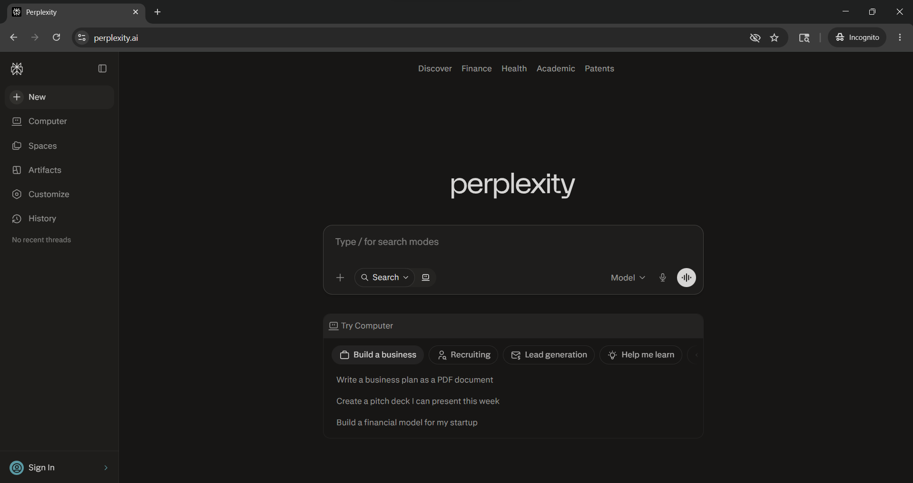
- **Gemini Entry:** Giao diện trang chủ Gemini với ô nhập liệu và các gợi ý trò chuyện.
  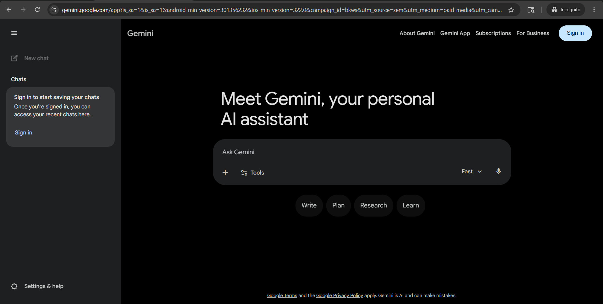

### 1.4. Nhận định
Cả hai đều có điểm chạm đầu tiên cực kỳ trực quan, nhưng Perplexity định vị mình rõ ràng là một "Cỗ máy tìm kiếm" (Search Engine) thay thế Google, trong khi Gemini định vị mình như một "Trợ lý ảo đa năng" (Assistant).

---

## S2 — WORKFLOW EVIDENCE (Bằng chứng quy trình)

### 2.1. Luồng người dùng
- **TRƯỚC:** Người dùng nảy sinh nhu cầu mua sắm, cần đọc review trên mạng.
- **TRONG (Perplexity):** Nhập câu hỏi -> Quét tự động -> Hiển thị nguồn phía trên -> Hiển thị bài tổng hợp với các nhãn trích dẫn trực tiếp (in-line citations) như `xgear`, `laptoptitan`, `reddit`.
- **TRONG (Gemini):** Nhập câu hỏi -> Gemini trả về văn bản định dạng cực đẹp, chia mục rõ ràng nhưng ít khi làm nổi bật link nguồn gốc. Có tính năng tự tạo "Bảng so sánh nhanh".
- **SAU (Perplexity):** Đọc các câu hỏi đào sâu (Follow-ups) về VRAM, cấu hình để giữ vòng lặp nghiên cứu, hoặc bấm nút "10 sources".
- **SAU (Gemini):** Nhận "Lời khuyên nhỏ" tư vấn thêm về việc thuê Cloud GPU, hoặc bấm nút "Export to Sheets" để xuất bảng so sánh.

### 2.2. 3 Friction Areas
- **Physical load:** Ngang nhau. Cả hai đều chỉ tốn 1 click để nhận lại toàn bộ bài tổng hợp.
- **Cognitive burden:** Perplexity giúp người dùng đỡ "nặng đầu" hơn vì hiển thị ngay thanh "Sources" trên cùng, kèm hình ảnh minh họa nhỏ, giúp người dùng biết AI đang đọc nguồn nào. Gemini ẩn bước tìm kiếm.
- **User workarounds:** Với Gemini, người dùng thường phải tự mở Google Search một lần nữa để xác minh giá và nơi bán xem AI có nói xạo không.

### 2.3. Bằng chứng
- **Perplexity Input/Output:**
  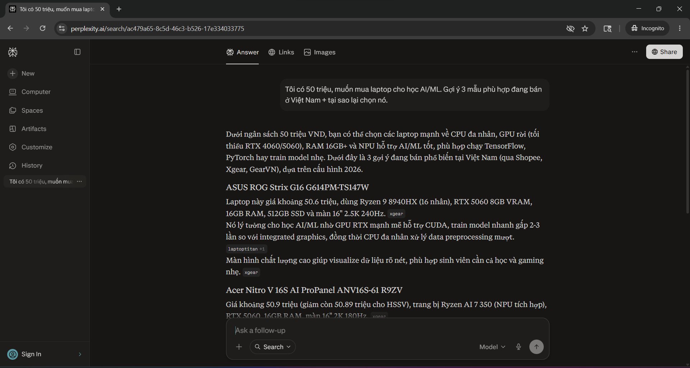
  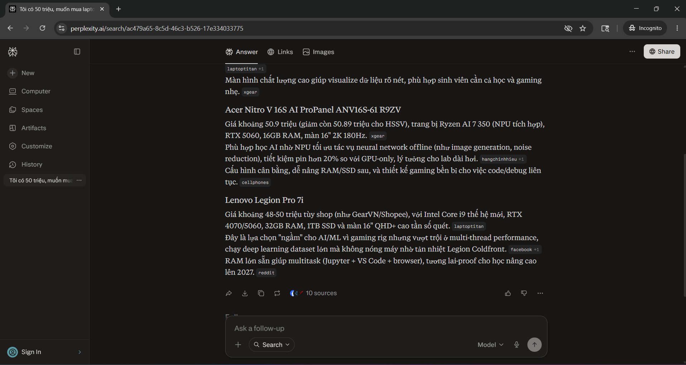
- **Gemini Input/Output:**
  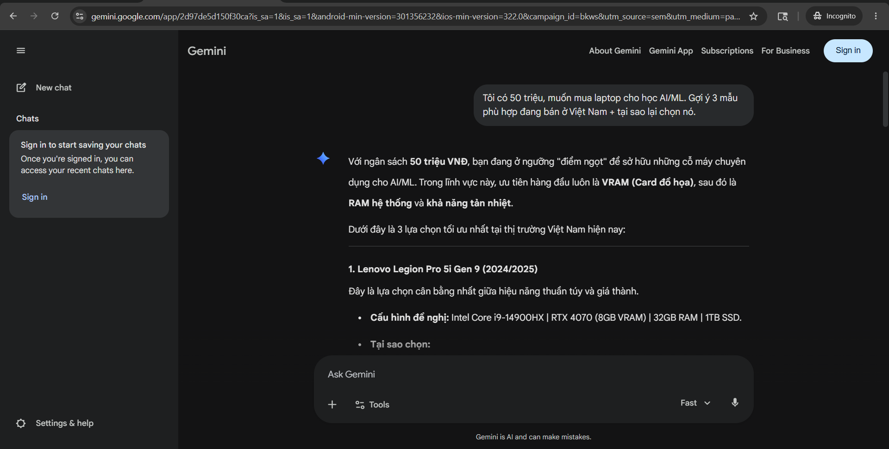
  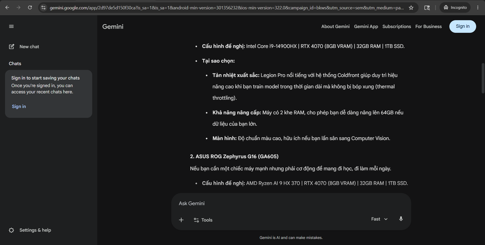

### 2.4. Nhận định
Về trải nghiệm "Tìm kiếm", Perplexity giảm ma sát kiểm chứng (verification friction) cực tốt nhờ việc nhúng trực tiếp trích dẫn nguồn vào văn bản. Ngược lại, Gemini hoạt động xuất sắc ở vai trò "Cố vấn đa năng" với khả năng định dạng cấu trúc, lập bảng và kết nối với Google Workspace.

---

## S3 — OUTPUT & TRUST (Kết quả + độ tin cậy)

### 3.1. Bảng chất lượng output
| Tiêu chí | Perplexity | Gemini |
|---|---|---|
| Đúng nội dung? | Đúng (chỉ ra các mẫu có GPU RTX 4060/4070). | Đúng (cũng gợi ý laptop gaming/workstation). |
| Có bịa giá không? | Giá khá sát thực tế thị trường VN vì quét web realtime. | Thỉnh thoảng bị ảo giá hoặc báo giá USD quy đổi sai. |
| Tiếng Việt tự nhiên? | Tự nhiên, rõ ràng. | Rất tự nhiên (vốn là thế mạnh của Google). |
| Đầy đủ/thiếu phần? | Cung cấp đủ tên máy, cấu hình, giá, link bán lẻ. | Định dạng đẹp, có bảng so sánh, nhưng thiếu link shop cụ thể. |
| Tốc độ (s) | ~4-6 giây (quét nhiều nguồn). | ~3-5 giây. |

### 3.2. Bảng 6 tín hiệu đáng tin
| Tín hiệu | Perplexity | Gemini |
|---|---|---|
| Citation | Cực mạnh. Đánh số và có nhãn chữ (xgear, reddit). | Có dấu mũi tên nhỏ trỏ xuống dưới cùng (khó thấy). |
| Control | Cho phép xóa nguồn không thích và Generate lại. | Nút "Double-check response" (Chữ G). |
| Confidence indicator | Không hiển thị độ tự tin dạng số. | "Double-check" bôi xanh/vàng/đỏ các câu text. |
| Failure handling | Tự đề xuất câu hỏi làm rõ nếu prompt mơ hồ. | N/A |
| Feedback | Thumbs up/down, Report Flag. | Thumbs up/down, Modify response. |
| Handoff to human | Click thẳng vào link để tự đọc bài gốc. | Nhấn nút Google để tra cứu lại. |

### 3.3. Bằng chứng
- **Perplexity Citation/Sources:** Hiển thị trích dẫn [1], [2] của Perplexity.
  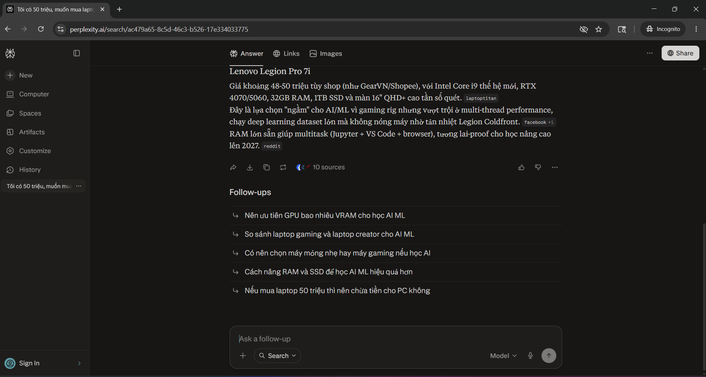
- **Gemini Double Check:** Hiển thị tính năng Double Check chữ G của Gemini.
  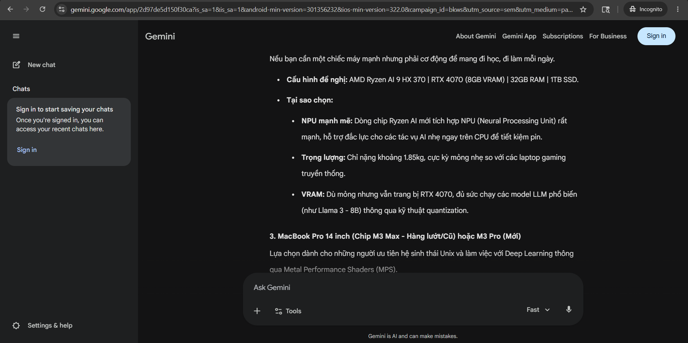

### 3.4. Nhận định
Perplexity chiến thắng tuyệt đối về "Độ tin cậy" nhờ UI sinh ra dành riêng cho việc cite nguồn (citation-first UI). Nút Double-check của Gemini tuy hay nhưng mang tính chất vá lỗi "sau khi sinh text" hơn là lấy nguồn làm gốc từ đầu.

---

## S4 — BUSINESS / USAGE SIGNAL

### 4.1. Mô hình giá
| Yếu tố | Perplexity | Gemini |
|---|---|---|
| Gói miễn phí | Có (Unlimited Standard Search). | Có (Dùng Gemini Flash cơ bản). |
| Giá thấp nhất | $20/tháng (Gói Pro). | $20/tháng (Gemini Advanced). |
| Pay-for-output? | Trả theo gói tháng. | Trả theo gói tháng (bundle Google One). |
| Quota / limit | Free: 5 Pro Searches/4 tiếng. | Advanced: Không giới hạn rõ ràng. |

### 4.2. Cost-Capability-Speed
- **Perplexity:** Tốn $0 cho nhu cầu search cơ bản / CAPABILITY: Cao (chọn được Sonnet 3.5, GPT-4o nếu có Pro) / SPEED: Trung bình khá.
- **Gemini:** Tốn $0 / CAPABILITY: Rất cao (được dùng Gemini 1.5 Pro) / SPEED: Cực nhanh.
- **Trade-off:** Perplexity bắt trả $20 để dùng Pro Search (suy luận nhiều bước sâu hơn), còn Gemini gộp luôn gói $20 vào Google One (kèm 2TB Drive), khiến mô hình giá của Gemini hấp dẫn hơn hẳn với người dùng phổ thông.

### 4.3. Bằng chứng
- **Perplexity Pricing:** N/A (Chưa chụp)
- **Gemini Pricing & Extra:**
  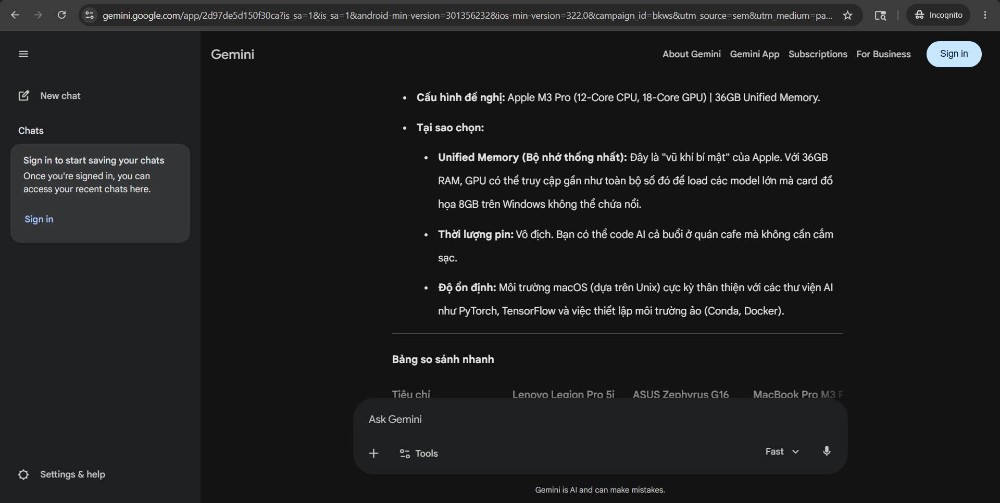
  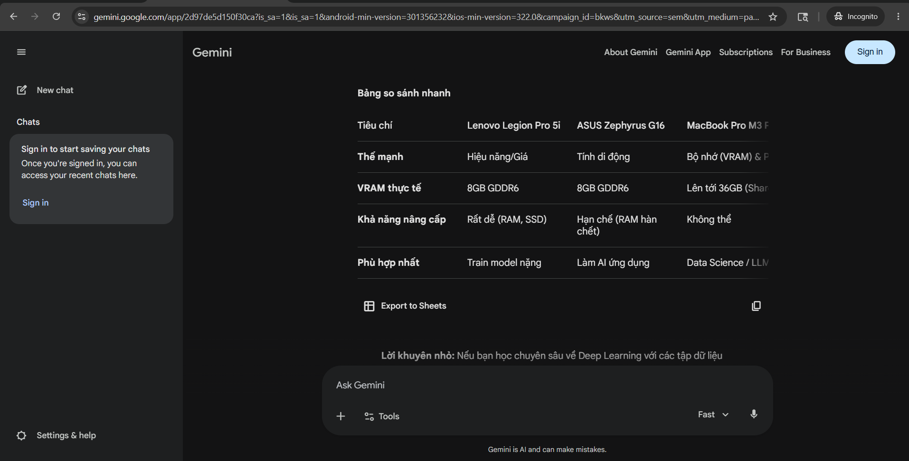
  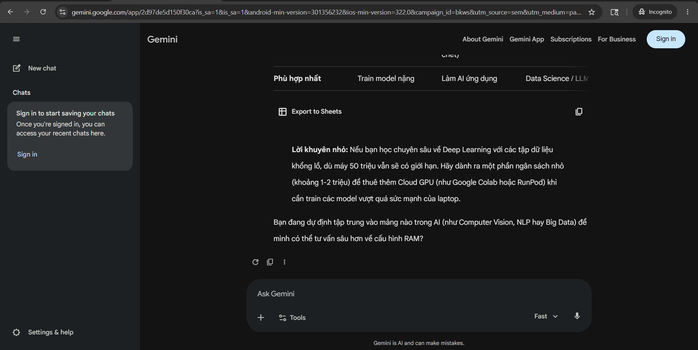

### 4.4. Nhận định
Perplexity bán "Khả năng truy xuất kiến thức sâu", còn Gemini bán "Hệ sinh thái tiện ích". Đối với người dùng chỉ cần tìm thông tin, bản miễn phí của Perplexity đã là quá đủ.

---

## S5 — PRODUCT JUDGMENT

### 5.1. Verdict tóm tắt
- **Perplexity: STRONG** — UX xuất sắc đánh trúng tim đen của người dùng muốn tra cứu thông tin có kiểm chứng (Expectation Shift 1: Do the work for me).
- **Gemini: PROMISING** — Lợi thế phân phối (Distribution) khổng lồ nhưng trải nghiệm chat vẫn còn hơi chung chung, chưa tối ưu đặc thù cho thao tác "Search & Verify".

### 5.2. User base + tốc độ tăng trưởng
| Chỉ số | Perplexity | Gemini | Nguồn |
|---|---|---|---|
| MAU (Monthly Active) | >10 triệu | Hàng tỷ (nằm trong Google Workspace) | Báo cáo nội bộ, TechCrunch |
| Tăng trưởng | Đang tăng nóng (Viral) | Tăng trưởng ổn định | |

*Nhận định:* Perplexity đang ăn lạm vào tệp người dùng tìm kiếm chất lượng cao của Google nhờ định vị khác biệt.

### 5.3. Doanh thu / pricing power
- Cùng mức giá $20, Gemini có Pricing Power mạnh hơn vì là mô hình Bundle (kèm Cloud, Docs, Meet). Perplexity gặp rủi ro nếu người dùng thấy $20 chỉ cho tính năng "tìm kiếm sâu" là hơi đắt.

### 5.4. Moat phân tích
- **Perplexity (Moat: Brand & UX):** Giao diện Citation-first định vị độ tin cậy. **Điểm yếu:** Hoàn toàn dựa vào Rented Land (thuê mô hình của OpenAI/Anthropic và index của Bing/Google).
- **Gemini (Moat: Distribution & Data):** Tích hợp sẵn trên Android, Google Workspace. Dữ liệu Search Index lớn nhất thế giới. Rất khó sụp đổ.

### 5.5. Data flywheel + feedback loop
- Perplexity dùng click của user vào các source để rank (xếp hạng) nguồn tin nào chất lượng. Vòng lặp này giúp kết quả search ngày càng tốt. Tuy nhiên, Google/Gemini sở hữu lượng click data trong 20 năm qua, flywheel lớn hơn nhiều.

### 5.6. Niche Down + AI Feature Map
- **Niche của Perplexity: STRONG** — Tập trung 100% vào tệp người làm nghiên cứu (Researchers, Students) và những người chán quảng cáo Google.
- **Niche của Gemini: WEAK** — Ôm đồm làm trợ lý cho tất cả mọi người, mọi tác vụ.

### 5.7. Spark → Loop → System
- **Perplexity:** Đang là **LOOP** (trợ lý tìm kiếm tương tác) tiến lên **SYSTEM** (Perplexity Pages tự tổng hợp thành bài viết lớn).
- **Gemini:** Nằm ở mức **SPARK / LOOP** (hỏi đáp truyền thống).

### 5.8. Liên hệ với Lab 1 case
- **Rủi ro Disruption:** Nếu Chegg sụp đổ vì người dùng muốn AI giải thẳng bài tập thay vì đưa link, thì Google (mô hình cũ) có nguy cơ tương tự vì người dùng đang thích Perplexity (tổng hợp sẵn câu trả lời) thay vì Google Search (hiển thị 10 đường link xanh phải tự click).
- **Bài học:** Perplexity chính là "Kẻ bóp nghẹt" (Big Squeeze) đang phá vỡ Channel Model Fit của Google Search (mô hình sống bằng quảng cáo trên các đường link).
