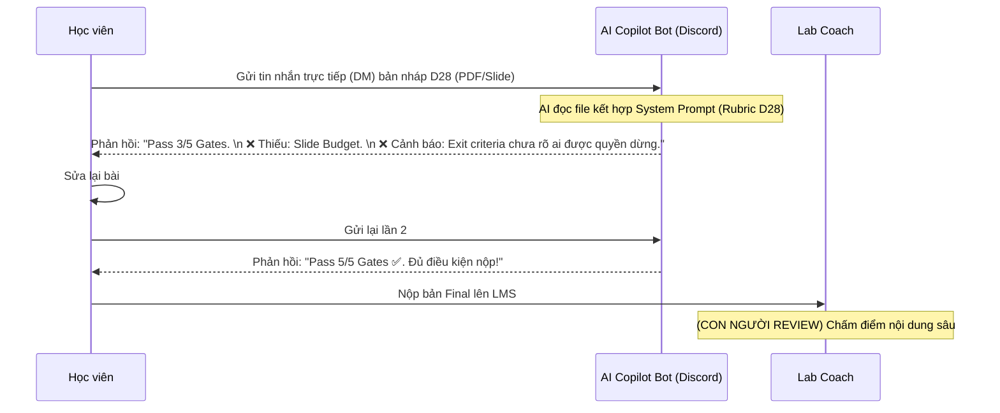

# 2 — FINAL: Solution Approach + Demo/Mockup/Flow

Mục tiêu: chốt cách làm cho Quick Win (Build / Buy / Boost / Partner), nói rõ data & ai review cần có, và tạo 1 bản vẽ trực quan để stakeholder *nhìn* được. Đây là nửa "siết lại" của [Double Diamond](https://www.thefountaininstitute.com/blog/what-is-the-double-diamond-design-process) vòng 2 và là bản nộp của phase Solution.

Lý do làm bước này: hai cái bẫy. Một, "tự build" cho oai — trong khi 80–90% nhu cầu nội bộ chỉ cần Boost/Buy; tự build là quyết định khó rút lại nhất. Hai, chỉ nói bằng chữ — stakeholder không duyệt một đoạn văn, họ duyệt khi *nhìn thấy* flow. Không có bản vẽ → trượt Gate 4 dù lập luận tốt.

Quy tắc: **bản vẽ trực quan là BẮT BUỘC; demo chạy được chỉ là điểm cộng.** *Demo đơn giản + lập luận chặt > demo đẹp + lập luận yếu.*

## Quy trình 12 phút

```text
4 phút  — Phần A: chốt Build/Buy/Boost/Partner (decision tree + ego check)
3 phút  — Phần B: data & ai review cần có
5 phút  — Phần C: vẽ 1 artifact trực quan + đánh dấu chỗ người review
```

---

## Phần A — Chốt cách làm

Đi decision tree, đừng chọn theo cảm giác:

```text
Bài này có phải LỢI THẾ CẠNH TRANH CỐT LÕI không?
 ├─ CÓ  → đội có AI engineer mạnh? CÓ → Build · KHÔNG → Boost
 └─ KHÔNG (chỉ là productivity layer) → có tool sẵn?
          CÓ → Buy · KHÔNG → Boost (model sẵn + data riêng)
```

Câu hỏi phụ:

- Nhóm chọn cách này vì *cần* hay vì *thích tự build*? Một câu thành thật.
- Hướng nào ở file `1` (đã tìm được người làm rồi) khớp với cách này — "đi từ 5 lên"?

### Trả lời

### Trả lời

- **Cách làm chốt**: Boost
- **Lý do CẦN (không phải thích), 2–3 câu**: Tiền kiểm bài nộp chỉ là lớp nâng cao hiệu suất (productivity layer), không phải công nghệ lõi cần giấu. Cộng đồng học viên đã quen dùng Discord hàng ngày, việc tích hợp một bot Discord gọi LLM API là cách nhanh nhất để thử nghiệm (evidence nhanh) mà không bắt học viên học cách dùng phần mềm mới.
- **Vì sao KHÔNG "Build từ số 0"**: Tự build một web app upload file sẽ phải lo authentication, giao diện, lưu trữ file, database. Tốn thời gian vô ích thay vì tập trung vào tối ưu Prompt Rubric.
- **Tool / API / vendor cần + ước lượng chi phí thô** (budget nhỏ, ưu tiên sẵn có): Discord Bot API (Miễn phí), OpenAI API (GPT-4o-mini). Ước tính chi phí siêu rẻ: ~$0.001/lượt kiểm tra, pilot cho 30 nhóm tốn chưa tới $1.

## Phần B — Data & ai review (cách làm này cần gì để chạy được)

| Cần gì | Có sẵn trong AI20k? | Trong lab dùng (mẫu/giả định) | Privacy? |
|---|---|---|---|
| Data: Rubric chấm điểm D28 chi tiết | Có sẵn (D28 Handbook) | File `rubric-gate-sheet.md` | Không nhạy cảm (Public) |
| Data: Bản nháp của học viên (PDF/MD) | Có sẵn (khi làm bài) | Bản nháp giả định của nhóm | Gửi qua DM (Tin nhắn riêng với Bot), không lưu trữ DB ngoài |

- **Output nào rủi ro cao** (sai gây hậu quả): Nếu AI bị "ảo giác" và báo thiếu một mục mà học viên *thực chất đã làm*, khiến học viên hoang mang sửa lại sai.
- **Ai review + bao nhiêu mẫu + pass/fail theo gì**: Lab Coach sẽ review prompt. Chạy thử 10 bản nháp cũ của khóa trước. Pass nếu AI tìm trúng 100% các mục thiếu và Tỷ lệ báo ảo (False Positive) < 5%.
- **Có cần citation / nói "không biết" khi thiếu nguồn không**: Có, yêu cầu AI phải trích dẫn (quote) phần text trong bài nộp khiến nó kết luận là "có", nếu không tìm thấy thì báo thiếu, không được tự suy diễn "hình như có".

## Phần C — Bản vẽ trực quan (BẮT BUỘC)

Chọn **1** dạng nhẹ nhất đủ rõ (xem `templates/demo-examples.md`): mockup 2–3 màn hình · user flow trước/sau · prompt flow · agent flow · 1 cặp input–output thật. Vẽ tay / ASCII / bảng đều được.



Chỗ con người review (output rủi ro cao) nằm ở: Cuối quy trình, Coach là người ra quyết định chấm điểm chất lượng lập luận cuối cùng, AI chỉ làm nhiệm vụ rà soát "Checklist" trước đó.

Câu hỏi phụ — một người đóng vai stakeholder nhìn 20 giây: *hiểu user làm gì, nhận lại gì, không cần giải thích thêm không? Có chỗ nào "đẹp nhưng rỗng" không?*

---

## Tổng kiểm tra trước khi sang `../03-pilot-plan/`

| Hạng mục | Xong? |
|---|---|
| Cách làm có lý do CẦN, không phải "mặc định tự build" | [x] |
| Nói rõ data cần + ai review output rủi ro cao | [x] |
| Có ≥1 bản vẽ trực quan, người ngoài hiểu trong ~20 giây | [x] |
| Có đánh dấu chỗ con người review | [x] |

⚑ Coach kiểm tra ở Mốc 3: *"Stakeholder nhìn vào đâu để hiểu flow? Mockup/sketch/demo đâu?"* Chỉ nói bằng chữ = chưa qua.

Sau bước này, mở `../03-pilot-plan/1-pilot-plan.md`.

*Liên quan: handbook §A5+§A6 · `templates/demo-examples.md` · `prompts/05-demo-challenge.md`*
